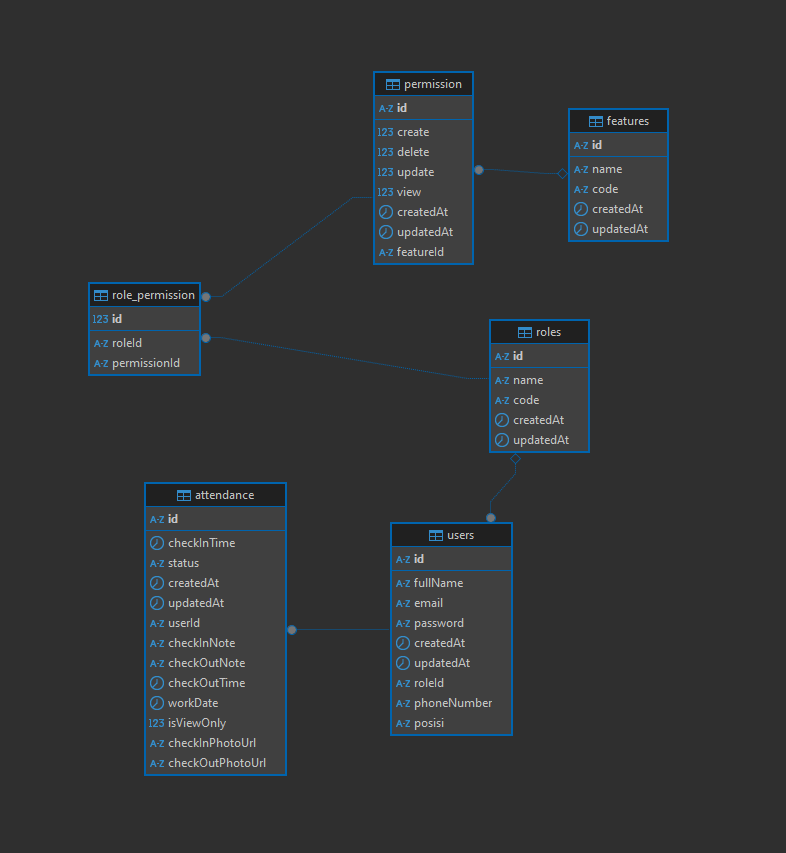

# Dexa Test - WFH Employee Attendance & HR Monitoring System (Backend)

A backend system for managing Work-From-Home employee attendance and HR monitoring, built as a set of NestJS microservices. The system handles authentication, user & role management, and daily attendance (check-in / check-out).

## Architecture

The backend is split into 4 independent NestJS services, each with its own database schema (via Prisma):

| Service | Responsibility | Default Port |
|---|---|---|
| `api-gateway` | Single public entry point. Exposes REST endpoints to clients, handles JWT auth middleware, file uploads, and Swagger docs, then forwards requests to internal services. | `8080` |
| `auth` | Login, token refresh, and JWT issuance. | `8001` |
| `user` | User CRUD, roles & permissions. | `8000` |
| `attendance` | Check-in/check-out, attendance list, dashboard, and view-only/resubmission flows. | `8002` |

Each service (`auth`, `user`, `attendance`) uses **Prisma ORM** on top of MySQL/MariaDB, and generates its own Swagger documentation at `/docs`.

### Internal service communication

> **Note on gRPC:** the original plan for this project was to have all internal service-to-service communication go through **gRPC** (or another proper RPC protocol) using Protocol Buffers, for stronger typing and performance between services. Given the limited time for this technical test, that plan was only partially realized:
>
> - The **`user`** service does expose a working gRPC server (see `user/proto/user.proto`) alongside its TCP transport, since it was the service other services would most need to query.
> - **`auth`** and **`attendance`**, however, only implement NestJS's built-in **TCP microservice transport** (`@nestjs/microservices`, `Transport.TCP`) using message patterns (`@MessagePattern({ cmd: '...' })`) instead of gRPC.
> - The **`api-gateway`** talks to all three internal services as NestJS `ClientProxy` instances over TCP, using `client.send({ cmd: '...' }, payload)` request/response calls rather than raw HTTP calls between services.
>
> In short: the *external*-facing API (gateway → client) is plain RESTful HTTP with Swagger docs, while *internal* service-to-service calls use NestJS's TCP-based RPC pattern instead of the originally intended full gRPC setup, due to time constraints during the test. Migrating the remaining services (`auth`, `attendance`) to gRPC using the same approach as `user` would be the natural next step.

```
Client
  │  (REST / HTTP)
  ▼
api-gateway (8080)
  │
  ├──(TCP / RPC, cmd pattern)──▶ auth (3002)
  ├──(TCP / RPC, cmd pattern)──▶ user (3001)  ──(gRPC, user.proto)──▶ consumed by attendance (planned)
  └──(TCP / RPC, cmd pattern)──▶ attendance (3000)
```

## Tech Stack

- **Framework:** NestJS 11
- **Language:** TypeScript
- **ORM:** Prisma (MySQL/MariaDB)
- **Inter-service transport:** NestJS TCP microservices (`@nestjs/microservices`), with a gRPC channel on the `user` service (`@grpc/grpc-js`, `@grpc/proto-loader`)
- **Auth:** JWT (access + refresh tokens), Passport
- **File uploads:** Multer (attendance check-in/check-out photos)
- **API docs:** Swagger (`@nestjs/swagger`) on each service and the gateway
- **Validation:** class-validator / class-transformer
- **Package manager:** pnpm
- **Testing:** Jest

## Project Structure

```
dexa-test-be/
├── api-gateway/        # Public REST entry point
│   └── src/
│       ├── routes/      # auth.route.ts, user.route.ts, attendance.route.ts
│       ├── middlewares/ # JWT auth middleware
│       ├── config/      # service URLs/hosts/ports config
│       └── lib/         # exception filter, service-call helper
├── auth/                # Auth microservice
│   └── src/api/modules/auth/
├── user/                # User microservice
│   ├── proto/user.proto # gRPC contract
│   └── src/api/modules/users/
└── attendance/          # Attendance microservice
    └── src/api/modules/attendance/
```

## Getting Started

### Prerequisites

- Node.js (LTS)
- pnpm
- MySQL/MariaDB instance

### Setup

Each service is run independently. For every service (`api-gateway`, `auth`, `user`, `attendance`):

```bash
cd <service-folder>
pnpm install
cp .env.example .env   # then fill in the values
```

For the `auth`, `user`, and `attendance` services (which use Prisma), also run:

```bash
pnpm prisma:generate
pnpm prisma:migrate
```

### Running the services

Start each service in a separate terminal (order matters less for TCP, but the gateway needs the others reachable to actually serve requests):

```bash
# in auth/, user/, attendance/, and api-gateway/ respectively
pnpm start:dev
```

Once running:
- API Gateway (public REST API): `http://localhost:8080`
- Swagger docs per service: `http://localhost:<port>/docs`

## Key Environment Variables

Each internal service needs its own `DATABASE_URL` plus the host/port/app-name of the other services it talks to (e.g. `USER_SERVICE_HOST`, `USER_SERVICE_PORT`, `USER_SERVICE_APP_NAME`). The gateway needs `USER_SERVICE_URL`, `AUTH_SERVICE_URL`, `ATTENDANCE_SERVICE_URL`, and JWT settings. See each service's `.env.example` for the full list.

## API Overview (via API Gateway)

**Auth**
- `POST /auth/login`
- `POST /auth/refresh`

**User**
- `GET /user`
- `GET /user/role`
- `POST /user`
- `PATCH /user/:id`
- `DELETE /user/:id`

**Attendance**
- `GET /attendance/list`
- `GET /attendance/me/:id`
- `GET /attendance/dashboard/:id`
- `POST /attendance/checkin/:id` (multipart, with photo)
- `POST /attendance/checkout/:id` (multipart, with photo)
- `POST /attendance/set-view-only`
- `POST /attendance/resubmit-checkin`

## Known Limitations / Next Steps

- Only the `user` service has a real gRPC implementation; `auth` and `attendance` still use TCP-based RPC and should be migrated to gRPC with proper `.proto` contracts for consistency and stronger typing.
- No Docker/docker-compose setup yet — services currently need to be run and pointed at each other manually via `.env`.

## Screenshots

### Database Structure


## License

MIT © Rizky Naufal Alghifari
